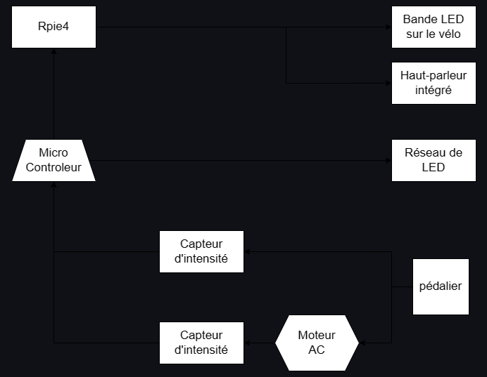
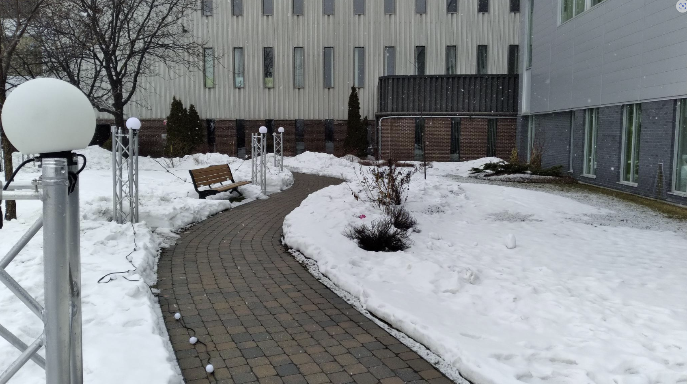
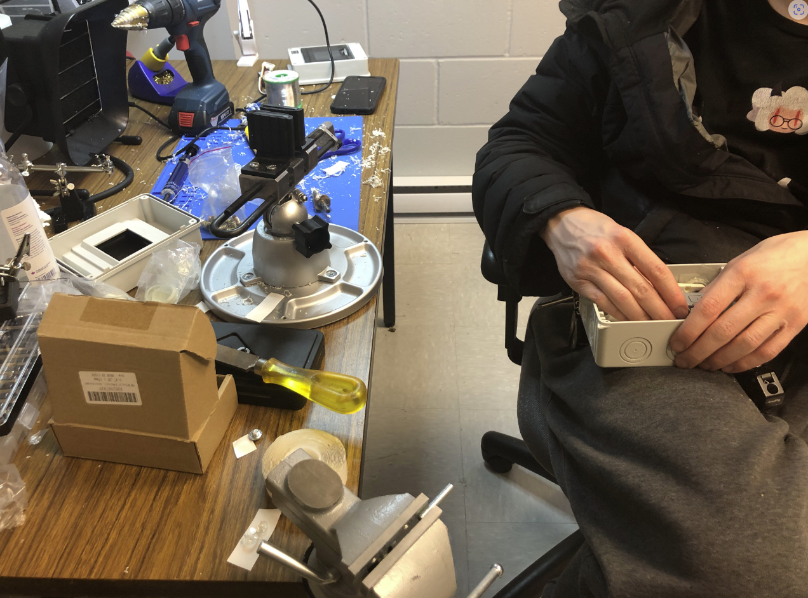

<h1>Analyse des projets en création réaliser par les étudiants de 3e année en TIM</h1>

<h1><a href="https://tim-montmorency.com/2023/projets/EDRIA/docs/web/index.html">1 - Edria</a></h1>
<h3>Réalisé par:Meryem Berbiche, Loic Delorme,Jean-Christophe, Gabriel LeblancElwin Durand et Dominic Roberts</h3>

Nous sommes allés rendre visite aux élèves de troisième année, il nous ont présenté le prototype de leur projet Edria. Il n'y avait qu'une demi-tour installer dans le studio afin de faire les teste necessaire. Les capteur installer, les speaker et les lumière fonctionnaient parfaitement. Il u avait trois types de capteur a activer. Lorsqu'un des capteurs étais déclenché, il jouait une musique unique avec un jeud de lumiére spécifique. Lorsque les trois capteurs étaient activés avec trois personne, les trois types de musique et jeu de lumiére ce déclenchaient simultanément, créant une experience unique.

Voici le schéma de l'installation que l'équipe on crée : <a href="https://github.com/F-C-A/EDRIA/blob/main/docs/medias/schema_electrique.png">SCHÉMA</a>. 

J'ai décidé de mettre ce projet en première place en raison de l'expérience immersive qu'il a créée. Non seulement elle permet à plusieurs personnes de participer à la création finale du projet, mais malgré la pluie, mon amie et moi avons visité l'exposition et l'expérience était magnifique. En activant les trois capteurs, nous avons aussi déclenché les trois jeux de lumière et sons. Plus la musique continuait, plus nous nous sentions comme dans un film d'action. J'ai été plus que satisfaite de l'exposition, j'étais impressionnée!

<h1><a href="https://tim-montmorency.com/2023/projets/Echomarine/docs/web/index.html">2 - Échomarine</a></h1>
<h3>Réalisé par:Maria Laura Coronel, Florence Lapierre, Tracy Gua et Natacha Abdallah </h3>

Pour ce projet, les étudiants ont décidé de créer une installation intérieure qui nous transportera dans un monde sous-marin. Ils ont créé un site web qui présente six sortes d'animaux différents. En cliquant dessus, une animation se lancera et l'animal spécifique nagera dans la chambre. Il n'y a pour l'instant que deux animaux animés, dont la baleine et la tortue. Lorsque l'animation est activée, nous pouvons également entendre le son de l'animal correspondant. L'équipe nous a montré leur plan de remplacer l'ordinateur par une tablette qui sera placée au milieu de la salle.

Voici le schéma de l'installation que l'équipe on crée : <a href="https://github.com/Echomarine/Echomarine/tree/main/docs/preproduction#plantation">SCHÉMA</a>.

Ce projet est en deuxième place car il était très original par rapport aux autres projets. Toutes les autres équipes ont utilisé des ampoules qui réagissent à des capteurs de mouvement, mais le projet Echomarine a utilisé une tablette interactive pour projeter des animaux sous-marins. Non seulement ce projet est très immersif et nous transporte dans un monde sous-marin, mais il est également informatif a cause qu'il décrit chaque espèce projetée. De plus lorsque l'un des animaux est en mouvement, nous entendons les sons qu'il émet. J'apprécie la simplicité du projet car elle démontre qu'une idée simple peut se transformer en une expérience incroyable.

<h1><a href="https://tim-montmorency.com/2023/projets/LumaSol/docs/web/index.html">3 - LumaSol</a></h1>
<h3>Réalisé par: Éloïse Gagné, Skayla Stimphil, Michaël Simard et Pénélope Morrisson</h3>

Lorsque nous avons visiter ce projet l'équipe avais installer des lumiéres sur une échelle afin de simuler un arbre. De plus, ils ont aussi brancher un moteur a un vélo stationnaire emprunter du gym. Le moteur n'étais pas attacher au velo, mais cétais a cause que ce n'étais pas le velo finale.  Le moteur s'active avec le velo qui déclanche un jeux de lumiére. Lorsque quelqu'un pedale cela va déclancher le moteur qui va ensuite démontrer le spectacle de lumiére qui démontre les 4 saison de l'année. Lorsque quelqu'un pedale pendant longtemps il va pouvoir aller a travers les 4 saisons. 

Voici le schéma de l'installation que l'équipe on crée : <a href="https://user-images.githubusercontent.com/70410591/215125260-d78220d7-4583-489d-9c77-34b1653faafd.png
">SCHÉMA</a>.

J'ai décidé de placer ce projet en troisième place à cause de l'interactivité possible qu'il offre. Le vélo encourage non seulement les gens à faire un peu de sport, mais aussi à avoir la possibilité d'interagir personnellement avec le projet. J'aime aussi le fait que ce projet économise de l'électricité grâce au moteur. . Ce projet demontre aussi un beau spectacle de lumiére est de sons qui t'emenne a travers les 4 saison de l'année.

<h1><a href="https://tim-montmorency.com/2023/projets/Nexum/docs/web/index.html">4 - Nexum</a></h1>
<h3>Réalisé par: Éloïse Gagné, Skayla Stimphil, Michaël Simard et Pénélope Morrisson</h3>

