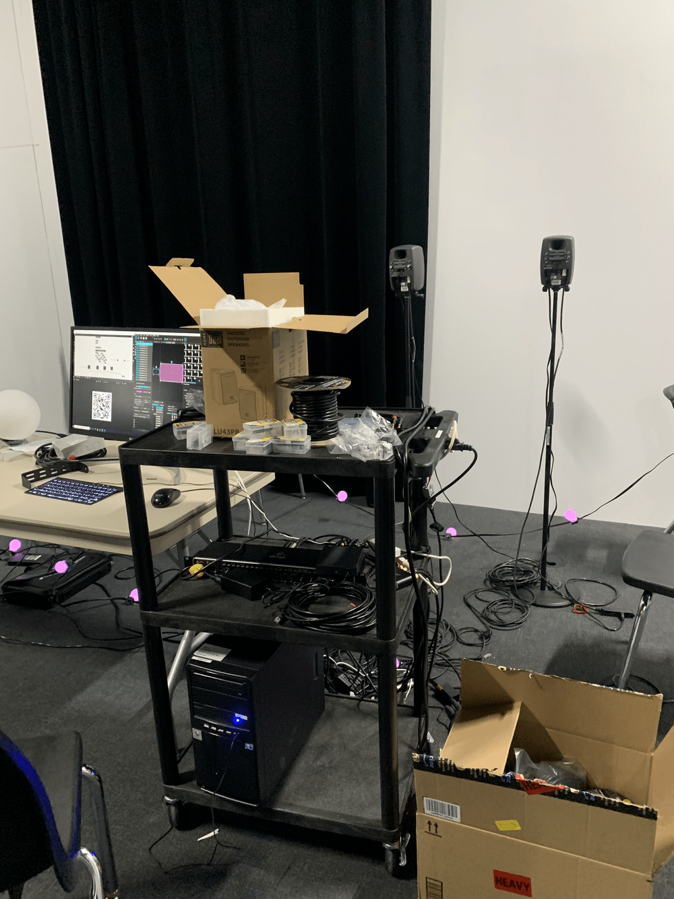
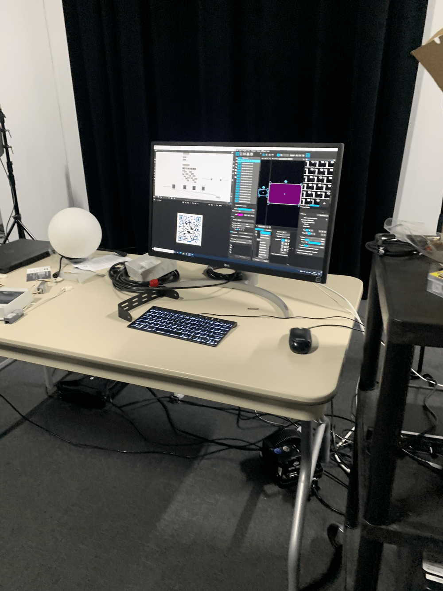
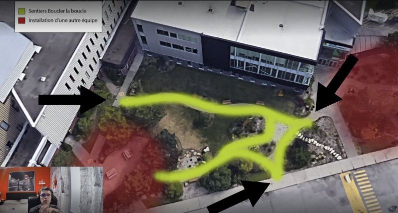

<h1>Analyse des projets en création réaliser par les étudiants de 3e année en TIM</h1>

<h1><a href="https://tim-montmorency.com/2023/projets/EDRIA/docs/web/index.html">1 - Edria</a></h1>
<h3>Réalisé par:Meryem Berbiche, Loic Delorme,Jean-Christophe, Gabriel LeblancElwin Durand et Dominic Roberts</h3>

Nous sommes allés rendre visite aux élèves de troisième année, ils nous ont présenté le prototype de leur projet Edria. Il n'y avait qu'une demi-tour installé dans le studio afin de faire les teste nécessaires avant l'instalation du projet. Les capteurs installés, les haut-parleurs et les lumières fonctionnaient parfaitement. Il y avait trois types de capteur à activer. Lorsqu'un des capteurs était déclenché, il jouait une musique unique avec un jeu de lumière spécifique. Lorsque les trois capteurs étaient activés avec trois personnes, les trois types de musique et jeu de lumière se déclenchaient simultanément, créant une expérience unique.

Voici le schéma de l'installation que l'équipe on crée : <a href="https://github.com/F-C-A/EDRIA/blob/main/docs/medias/schema_electrique.png">SCHÉMA</a>. 
Les étudiant on decidé d'installer leur structures dans la cabie central du shema. Puis nous pouvons retrouber le source de l'électricité dans l'école avec les files qui les suit.

J'ai décidé de mettre ce projet en première place en raison de l'expérience immersive qu'il a créée. Non seulement elle permet à plusieurs personnes de participer à la création finale du projet, mais malgré la pluie, mon amie et moi avons visité l'exposition et l'expérience était magnifique. En activant les trois capteurs, nous avons aussi déclenché les trois jeux de lumière et sons. Plus la musique continuait, plus nous nous sentions comme dans un film d'action. J'ai été plus que satisfaite de l'exposition, j'étais impressionnée!

<h1><a href="https://tim-montmorency.com/2023/projets/Echomarine/docs/web/index.html">2 - Échomarine</a></h1>
<h3>Réalisé par:Maria Laura Coronel, Florence Lapierre, Tracy Gua et Natacha Abdallah </h3>

Pour ce projet, les étudiants ont décidé de créer une installation intérieure qui nous transportera dans un monde sous-marin. Ils ont créé un site web qui présente six sortes d'animaux différents. En cliquant dessus, une animation se lancera et l'animal spécifique nagera dans la chambre. Il n'y a pour l'instant que deux animaux animés, dont la baleine et la tortue. Lorsque l'animation est activée, nous pouvons également entendre le son de l'animal correspondant. L'équipe nous a montré leur plan de remplacer l'ordinateur par une tablette qui sera placée au milieu de la salle.

Voici le schéma de l'installation que l'équipe on crée : <a href="https://github.com/Echomarine/Echomarine/tree/main/docs/preproduction#plantation">SCHÉMA</a>.

Ce projet est en deuxième place, car il était très original par rapport aux autres projets. Toutes les autres équipes ont utilisé des ampoules qui réagissent à des capteurs de mouvement, mais le projet Echomarine a utilisé une tablette interactive pour projeter des animaux sous-marins. Non seulement ce projet est très immersif et nous transporte dans un monde sous-marin, mais il est également informatif à cause qu'il décrit chaque espèce projetée. De plus, lorsque l'un des animaux est en mouvement, nous entendons les sons qu'il émet. J'apprécie la simplicité du projet, car elle démontre qu'une idée simple peut se transformer en une expérience incroyable.

<h1><a href="https://tim-montmorency.com/2023/projets/LumaSol/docs/web/index.html">3 - LumaSol</a></h1>
<h3>Réalisé par: Éloïse Gagné, Skayla Stimphil, Michaël Simard et Pénélope Morrisson</h3>

Lorsque nous avons visité ce projet, l'équipe avait installé des lumières sur une échelle afin de simuler un arbre. De plus, ils ont aussi branché un moteur à un vélo stationnaire emprunté du gym de l'école. Le moteur n'était pas attaché au vélo, mais c'étais à cause que ce n'étais pas le vélo finale. Le moteur s'active avec le vélo qui déclenche un jeux de lumière. Lorsque quelqu'un pédale cela va déclencher le moteur qui va ensuite démontrer le spectacle de lumière qui démontre les 4 saisons de l'année. Lorsque quelqu'un pédale pendant longtemps, il va pouvoir aller à travers les 4 saisons.

Voici le schéma de l'installation que l'équipe on crée : <a href="https://user-images.githubusercontent.com/70410591/215125260-d78220d7-4583-489d-9c77-34b1653faafd.png
">SCHÉMA</a>.

J'ai décidé de placer ce projet en troisième place à cause de l'interactivité possible qu'il offre. Le vélo encourage non seulement les gens à faire un peu de sport, mais aussi à avoir la possibilité d'interagir personnellement avec le projet. Le projet emmene les gens à venir observer les 4 differentes saison de l'année avec des different sorte de musique et couleur . J'aime aussi le fait que ce projet économise de l'électricité grâce au moteur.

<h1><a href="https://tim-montmorency.com/2023/projets/Nexum/docs/web/index.html">4 - Nexum</a></h1>
<h3>Réalisé par: Maxime Des Lauriers, Sébastien Reilly, Sabrina Laforest et  Alexandre Daniel</h3>

En visitant la dernière équipe, nous avons pur observer leur prototype de lumière accrocher sur des chaises. Ces chaises simulaient l'environnement ou il allait être accroché. L'équipe nous à expliquer que l'installation s'activait grâce à des capteurs de mouvement. Dans la démo, nous avons passé devant le capteur qui enclenchait les lumières qui allaient de gauche à droite, accompagné par des haut-parleurs qui jouait des sons accompagnateurs. L'équipe nous a aussi démontré un code QR qui nous emmenait à un site web qui jouait une animation d'art. Malheureusement le code fonctionnait seulement sur les Android.

Voici le schéma de l'installation que l'équipe on crée : <a href="https://tim-montmorency.com/2023/projets/Nexum/docs/journaux/medias/prise_1.png">SCHÉMA</a>.

Ce projet est en quatrième place, car il semble que ce projet démontre moins de possibilité d'interactivité intéressante que les autres. C'est une installation simple et efficace, mais j'aurais aimé avoir plus. J'adore le fait que les lumières passe à travers les ampoules un par un. J'aurais peut-être aimé avoir des couleurs différentes que juste rose. L'idée était très intéressante 

<h1>Conclusion</h1>

Tous ces projets sont extrêmement intéressants, est-on l'air très dur à accomplir. Les étudiants avaient l'aire d'avoir beaucoup d'expérience avec plusieurs sortes de programme varié que l'on va surement apprendre durant notre parcours en multimédia ! Il y avait plusieurs types de ressource que nous allons apprendre et que chacun des équipes ont utilisé, les lumières variées, des sons et musique unique et le codage de site web, l'utilisation de matérielle varié comme les capteurs et moteur. Pour les lumières les équipes, on utiliser des animations 2D animé dans after effects afin de créer des jeux de lumière différent. Échomarine ont utilisé after effects afin de créer leurs animations de créature sous-marine. Chacun des équipes ont créé des sons différents pour réaliser leur projet, le cours de conception sonore a servi à leur apprendre ces compétences. Puis, nous retrouvons les cours de java, css et html qui nous sont apprie durant tout nos sessions. l'équipe d'échomarine on crée un site web qui déclenchais les animations et le groupe de nexum, on crée un site web qui démontrait leur animation. Nous allons apprendre à utiliser les différents matériel durant notre passage en multimédia. Pourvoir utilisé des capteurs varié comme ceux de chaleur, mouvement et le différent type de moteur. Bref, nous avons encore beaucoup de chose à apprendre au courant de nos 4 prochaines session en multimédia.

