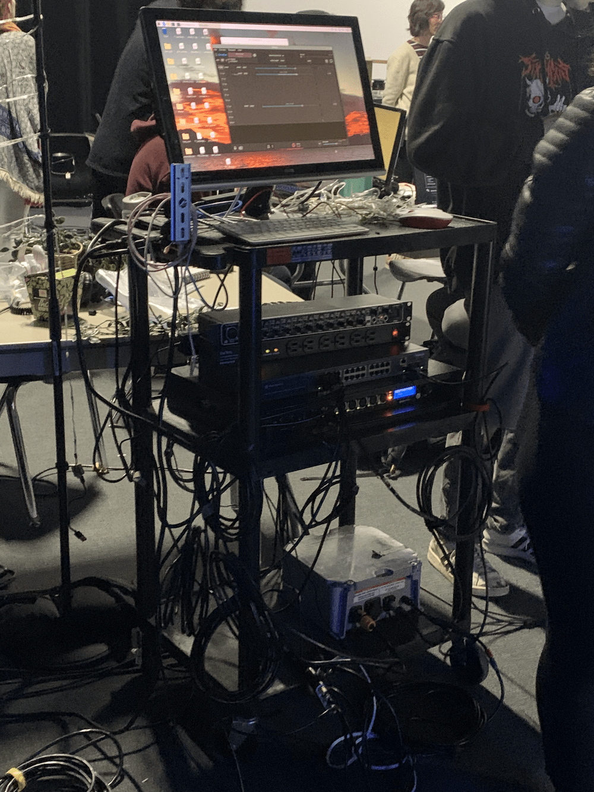
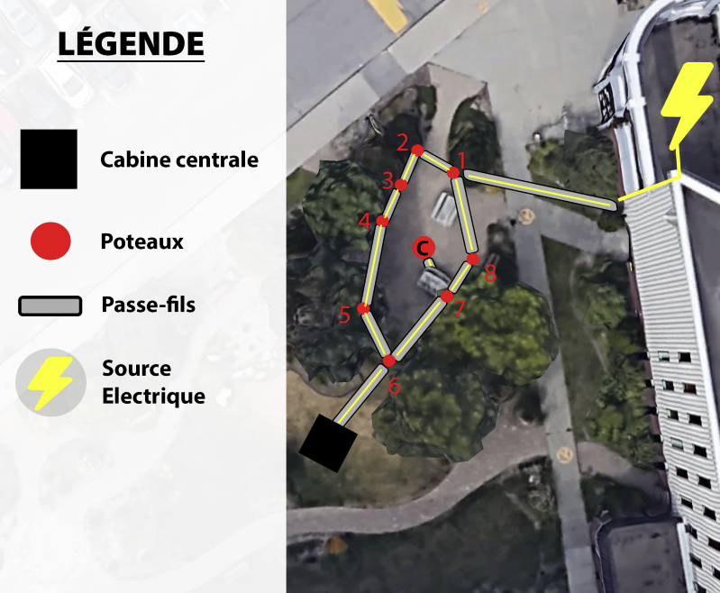
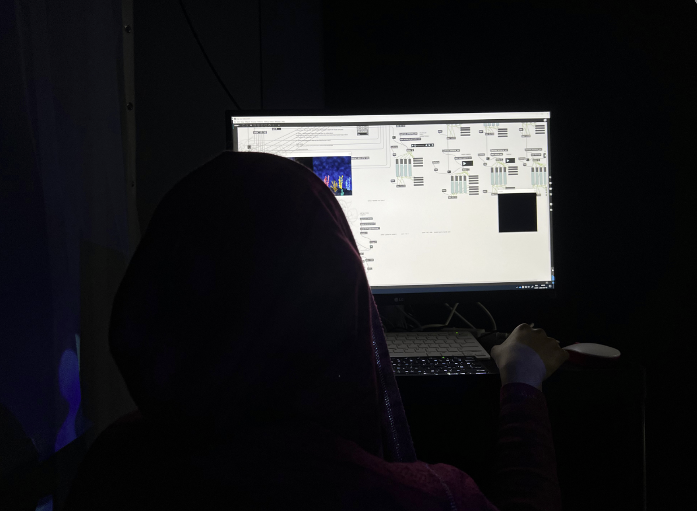
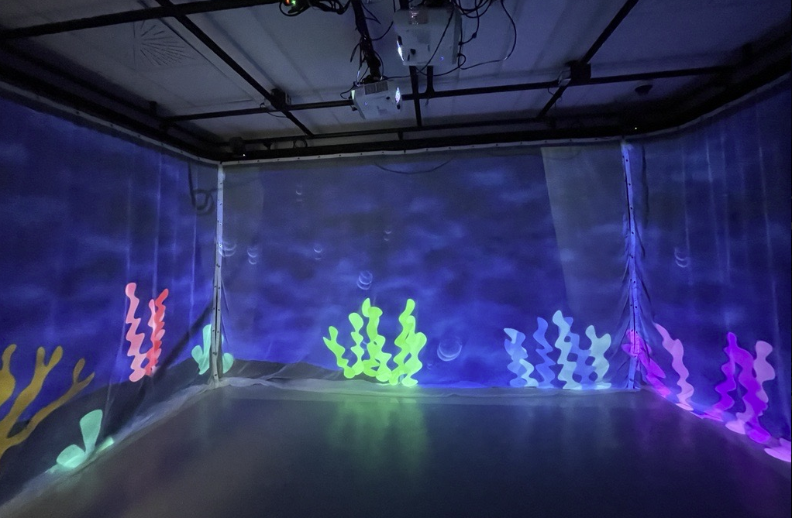

<h1>Analyse des projets en création réaliser par les étudiants de 3e année en TIM</h1>

<h1><a href="https://tim-montmorency.com/2023/projets/EDRIA/docs/web/index.html">1 - Edria</a></h1>
<h3>Réalisé par:Meryem Berbiche, Loic Delorme,Jean-Christophe, Gabriel LeblancElwin Durand et Dominic Roberts</h3>

Nous sommes allés rendre visite aux élèves de troisième année, qui nous ont présenté le prototype de leur projet. Il n'y avait qu'une demi-tour installée dans le studio, mais les capteurs et les haut-parleurs étaient installés et fonctionnaient parfaitement. Il y avait trois types de capteurs à activer. Lorsqu'un des capteurs était déclenché, il jouait une musique unique avec un jeu de lumières spécifique. Si les trois capteurs étaient activés avec 3 personnes, les trois types de musique et de jeux de lumière se déclenchaient simultanément, créant une expérience unique. 

Voici le schéma de l'installation que l'équipe on crée : <a href="https://github.com/F-C-A/EDRIA/blob/main/docs/medias/schema_electrique.png">SCHÉMA</a>. 

J'ai décidé de mettre ce projet en première place en raison de l'expérience immersive qu'il a créée. Non seulement elle permet à plusieurs personnes de participer à la création finale du projet, mais malgré la pluie, mon amie et moi avons visité l'exposition et l'expérience était magnifique. En activant les trois capteurs, nous avons aussi déclenché les trois jeux de lumière et sons. Plus la musique continuait, plus nous nous sentions comme dans un film d'action. J'ai été plus que satisfaite de l'exposition, j'étais impressionnée!

<h1><a href="https://tim-montmorency.com/2023/projets/Echomarine/docs/web/index.html">2 - Échomarine</a></h1>
<h3>Réalisé par:Maria Laura Coronel, Florence Lapierre, Tracy Gua et Natacha Abdallah </h3>

<h1><a href="https://tim-montmorency.com/2023/projets/LumaSol/docs/web/index.html">3 - LumaSol</a></h1>
<h3>Réalisé par: Éloïse Gagné, Skayla Stimphil, Michaël Simard et Pénélope Morrisson</h3>
